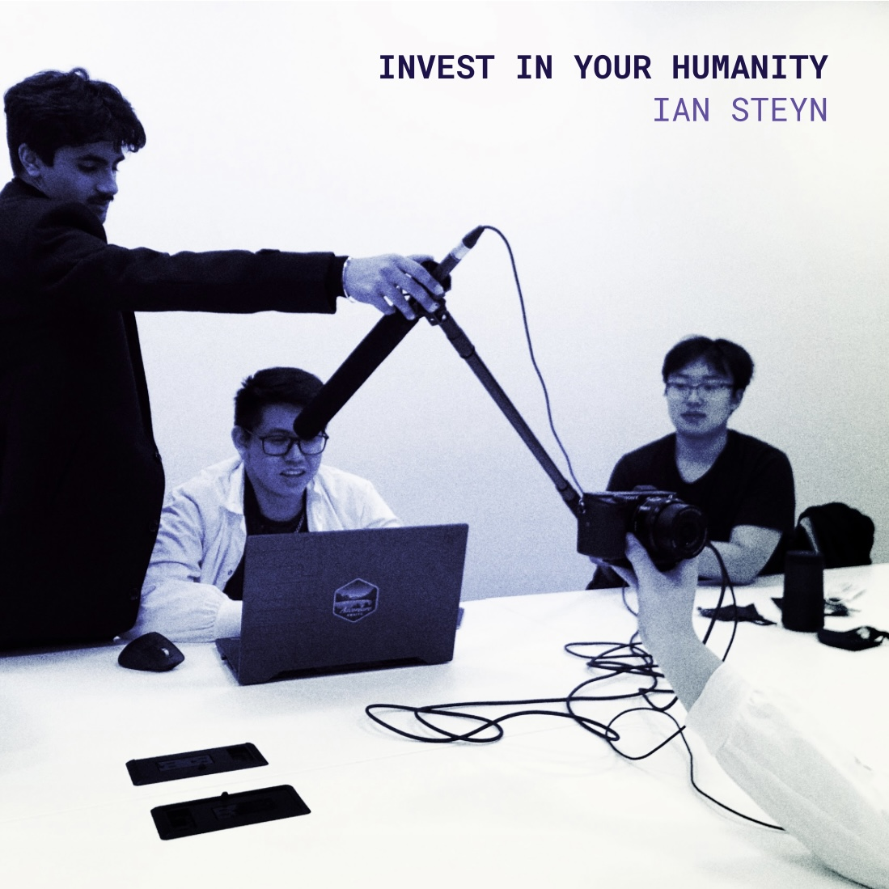

# _Invest In Your Humanity:_ a sonic coding project

## What is this?
_Invest in Your Humanity_ is the name of a "song" I created by live-coding in [Sonic Pi](https://sonic-pi.net/), using some of my own samples along with free [Dirt Samples](https://github.com/tidalcycles/Dirt-Samples).

### 🔗 [Listen to _Invest In Your Humanity_ on YouTube](https://youtu.be/dABln02w364?si=_-lQqBTPkltJNl09)

*Album cover I made using a silly photograph from the same engineering project video shoot that the core sample for the song is pulled from. The purple coloration comes from double exposure with another art piece I made with [Processing](https://processing.org/) for this Digital Media class.*

---

## Original README Contents

> [!NOTE]
> The materials in this repository were uploaded to GitHub in October 2025, but created in February 2023. This README is a modified version of one I submitted for grading alongside the project materials.

- **CLASS:** VISA 108 - Intro to Digital Media II
- **STREAM:** Computational Art
- **PROJECT:** Project 2 - Sonic Coding
- **DATE:** February 2023

### Introduction

I have very little musical knowledge. I’ve never had a natural talent for it, *and* I never really took the time and effort to learn. I’ve also never used Ruby or Sonic Pi, so… this was weird. It's way harder to 'visualize' a an audio medium. However, I had three pieces of knowledge that helped me figure it out in the end:

1. **An understanding that music has regular beats.** Sounds can go twice as fast, or half as slow, or even be irregular, but they have to conform to some cyclical pattern. 

2. **An understanding of the prompt.** I listen to normal music, but also a wide variety of weirder audio stuff on, from lo-fi to fully composed soundscapes built for TTRPGs to obscure, experimental jazz and electronic music I find on YouTube. I don’t say this to brag or gatekeep—I have no special technical appreciation for this stuff that other people “don’t understand”. I just happen to like it, and my exposure to that world meant I quite liked the prompt.

3. **A vague understanding that most songs have distinct elements** - percussion, a melody, maybe a bassline. I basically approached this project the same way 5th graders make a “sick beat” at lunch. One kid starts hitting a pencil rhythmically on a desk, another starts stomping to the same beat, someone says “boots and cats”. And maybe it sounds cool. I did that, only with code. 

### THE STORY

Once I had created the core song, I focused on building a story. I admit that the storytelling here is somewhat emergent and retrospective, but I think it’s kind of cool nonetheless. It helped me stitch the final product together in a way that feels more cohesive. 

The sample that I built everything on is the sound of my friend Andrew typing on a computer keyboard. I took it from [a video I made](https://youtu.be/ZD-uVNHXyZ8) to present my group's final design project back when I was an engineering student in April 2022. At the time, we all agreed it was a very satisfying sound and it really stuck in my memory. 

The keyboard (which I still use btw) represents a time in my life when I was deciding whether or not to continue engineering. On the one hand, I was quite good at it; we won the class’s design competition with that project. However, to reach that level of success I pretty much sacrificed everything else in my life — exercise, social interaction, sleep, and mental health in general. I had come to hate what I was doing. One thing I really enjoyed, though, was the production of that video. It helped push me over the edge to switch to Computer Science, where I would be able to do a minor in Visual Arts. 

Now that I’m in this program, I can look back and see that I didn’t hate *everything* I was doing. I *do* actually like math, and I love coding, and design — but because the ONLY thing in my life was an overwhelming amount of math, science, and analytical problem solving, I came to abhor even the things I had once enjoyed. 

Now that I have taken time to Invest in my Humanity, I am able to appreciate those things once again. Even so, school sometimes overwhelms me and I put too much of myself into it — and when that happens I have to take a step back and take a deep breath before starting again. 

Ok… I’ll try not to go into too much more detail, but with this in mind here’s an outline of the song’s narrative structure and some commentary on the sounds:

### THE SONG/SOUNDSCAPE

#### Prologue
The prologue serves a few purposes:
	- It introduces the core keyboard sound
	- It plants the theme of being overwhelmed with random beeps and layered noises. It’s unpleasant.
	- It showcases technical proficiency with randomized sound generation

#### Chapter 1 — Introduction to Investment
Here, another key sound is introduced — the coins, which are an auditory symbol for "investment". Confidence grows as the coins (aka investing in healthy things like exercise, getting enough sleep, doing things with friends) quickly find their place in the rhythms of the keyboard, kick, and popping “msg” sounds (aka work and daily life). There is a momentary pause and we take a deep breath… and before it is even over we plunge into a more complex soundscape.

#### Chapter 2 — Gathering Momentum
The moogs (long, deep, synthy sounds), bass and glitch sounds come in and give the piece an actual musical feel. The bass and msg noises sound different depending on what part of the song you're in, even though they don’t really change. They lend a sense of always building, always working, never resting. It isn’t perfectly linear, but the moogs are moving generally upward, building a sense of enthusiasm and inspiration. When the moogs cycle around and go from high to low again there's a reminder of tension. 

#### Chapter 3 — Epic Story Bro
As the moogs once again become enthusiastic in their second cycle, some marching band-ish drums come in. They align with the keyboard typing sounds, emphasizing the importance of achievement and hard work. They push us towards a positive climax of the song, to the peak of productivity and success.

#### Chapter 4 — Tension Held in the Jaw Muscles
But the triumphant drums fade as the moogs fall down low again. We’re starting to burn out, but the song still moves forward. The glitch, previously playing only every few beats, is now regular and almost overwhelms the coin sound. The keyboard clacking gets louder and louder, until even the thing we started with becomes something we abhor. The glitch gets faster, the song becomes frankly pretty unpleasant—but just before we hit breaking point, someone turns it all off and we get to step back. 

#### Chapter 5 — Abnegation
We continue to move forward, but quietly, simply. We return to what we started with, and it is a relief. 

#### Epilogue
Even that fades away, and we get a chance to take a deep breath (a full one this time) as the keyboard plays backwards and everything resets.

#### Loop
I originally envisioned the piece as a background track for my game project, so I wrote it to loop. I’m not sure if I’ll still use it, but try putting it on repeat. The loop is sort of what I go through—when things become too much, we stop, but pretty soon the workflow starts again and the cycle repeats. 

### TECHNICAL NOTES

`investInYourHumanity.wav` was made using live coding in Sonic Pi. I’ve included my Ruby files, which you can open in Sonic Pi to play sections of the song yourself. I’ve also included all the samples I used in the `finalSamples/` folder. Note that the subfolders are all named the same as in the Dirt Samples library if you want to find them there, except for `mySamples/` which contains my own keyboard recording. 

If you don't want to open them in Sonic Pi but still want to look at them, you can open the Ruby files with VS Code or whatever other code editor you use. 

As far as code readability goes, I made an effort to write the code in a self-descriptive way. Sonic Pi is really built to facilitate this, so my comments have been kept to a minimum. The few that are there divide sections or provide instructional reminders for me to change code live for when I was recording.

After recording a few different sections of the song in Sonic Pi, I combined them in Adobe Premiere Pro. It has one huge advantage for audio editing: I’ve used it before. I barely had to do anything but stitch clips together, but I’ve included the project folder and recordings in this submission as well. 

### End
And that’s all. Thanks for taking the time to read this—I know you didn’t ask for it, but with this type of experimental project, the development is important (and hard), and I wanted to share it with people who care. 
